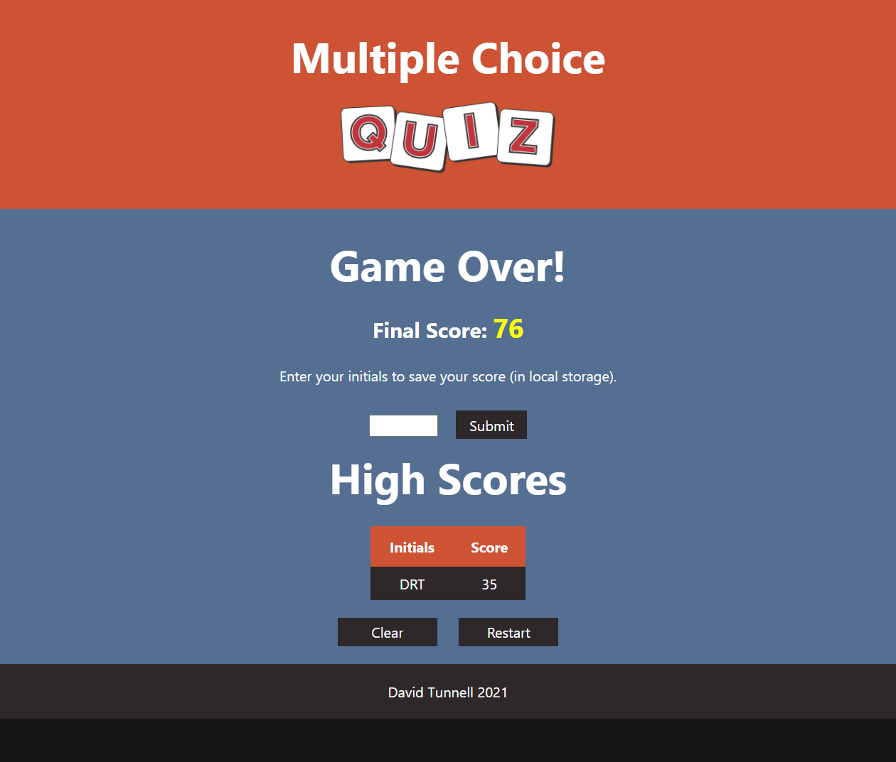

# Timed and Scored Multiple Choice Quiz
This is a JavaScript, HTML, CSS project from scratch for a gamified multiple choice quiz that is saveable to local storage. It includes the following pieces of functionality. 

1. HTML/CSS Styling
2. JavaScript Objects/Arrays/Data Structures 
3. Event Listeners
4. Randomized Questions Algorithm
5. Countdown/Penalty Score
6. Dynamic Rendering of HTML/CSS
7. Mobile Friendly Media Queries
8. Local Storage Scoreboard Saving / Clearing
9. Responsive JavaScript Controlled Controls
10. Local Storage Array Appending Functionality
11. Sort Array by Property Values Functionality

It can be viewed live here: https://davidtunnell.github.io/timed-and-scored-multiple-choice-quiz/

## Screenshots
### Start

### Quiz in Progress

### Scorecard and Saving
